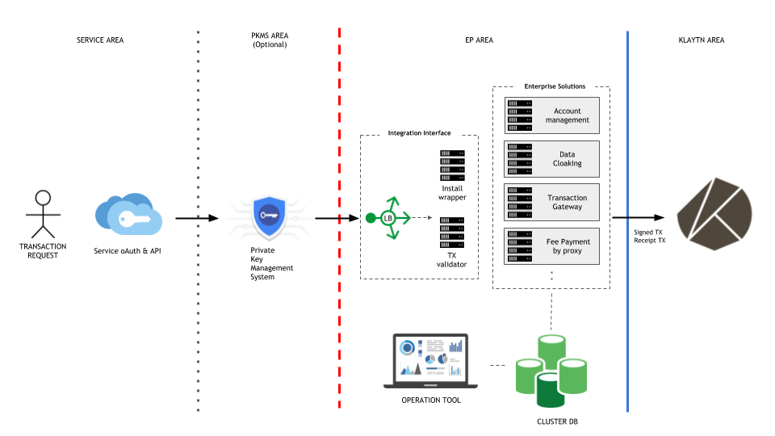

# Enterprise Proxy

EP stands for enterprise proxy. And this feature differentiates Klaytn from other blockchain platforms. EP is made to satisfy the business requirements of enterprise blockchain users and service providers while still containing the essential quality of public blockchain. Please find more details in [Official documentation of EP.](https://docs.klaytn.com/klaytn/enterprise_proxy)

---

### EP ARCHITECTURE


---

### GETTING STARTED
- maven compile
  - The EP-API is compiled into a WAR file for distribution.
  ```shell
  mvn clean package
  cd epi-api/target
  * ep-api-0.0.1-SNAPSHOT.war file will be created.
  ```
- application.properties (ep-api/src/main/resources)
  ```shell
  klaytn.rpc.server.host=<EN NODE RPC HOST>
  klaytn.rpc.server.port=<EN NODE RPC PORT>
  * The registered host is called by default if targetHost information is missing in the API.
  ```
  ```shell
  logging.level.root=log level (debug,info,error...)
  * The logging level is set as info by default.
  * You can change the level according to your dev or prod environment.
  ```
  ```shell
  feepayer.address=ENC(...)
  feepayer.password=ENC(...)
  feepayer.keyStoreFilePath=ENC(...)
  * You must create the delegated fee payer account in advance to use fee delegation functions.
  * The fee payer account information is designed to use Jasypt encryption for security reasons.
  ```
- application-h2.properties
  ```json
  ## editable properties
  # EPLOG (Enterprise Proxy Log)
  eplog.db.datasource.initialize=true
  eplog.db.datasource.driver-class-name=org.h2.Driver
  eplog.db.datasource.url=jdbc:h2:file:./h2db/eplog;MODE=MySQL;INIT=CREATE SCHEMA IF NOT EXISTS eplog\\;RUNSCRIPT FROM 'classpath:sql/h2/txgateway.sql';AUTO_SERVER=TRUE;DATABASE_TO_UPPER=false;DB_CLOSE_DELAY=1;IGNORE_UNKNOWN_SETTINGS=TRUE
  eplog.db.datasource.username=sa
  eplog.db.datasource.password=

  # EPOP (Enterprise Proxy Operation)
  epop.db.datasource.initialize=true
  epop.db.datasource.driver-class-name=org.h2.Driver
  epop.db.datasource.url=jdbc:h2:file:./h2db/epop;MODE=MySQL;INIT=CREATE SCHEMA IF NOT EXISTS epop\\;RUNSCRIPT FROM 'classpath:sql/h2/servicechain.sql';AUTO_SERVER=TRUE;DATABASE_TO_UPPER=false;DB_CLOSE_DELAY=1;IGNORE_UNKNOWN_SETTINGS=TRUE
  epop.db.datasource.username=sa
  epop.db.datasource.password=

  ## do not edit properties
  # profiles active
  spring.profiles.active=h2
  ```
- application-maria.properties
  ```json
  ## editable properties ##
  # EPOP (Enterprise Proxy Operation) DB
  epop.db.datasource.driverClassName=org.mariadb.jdbc.Driver
  epop.db.datasource.url=jdbc:mariadb:<MARIA DB HOST>/epop
  epop.db.datasource.username=<ID>
  epop.db.datasource.password=<PASSWORD>
  epop.db.datasource.initialSize=10
  epop.db.datasource.maxWait=6000
  epop.db.datasource.maxActive=50
  epop.db.datasource.validationQuery=select 1
  epop.db.datasource.testOnBorrow=true
  epop.db.datasource.testOnReturn=false
  epop.db.datasource.testWhileIdle=true
  epop.db.datasource.maxIdle=30
  epop.db.datasource.minIdle=10
  epop.db.datasource.timeBetweenEvictionRunsMillis=5000

  # EPLOG (Enterprise Proxy Log) DB
  eplog.db.datasource.driverClassName=org.mariadb.jdbc.Driver
  eplog.db.datasource.url=jdbc:mariadb:<MARIA DB HOST>/eplog
  eplog.db.datasource.username=<ID>
  eplog.db.datasource.password=<PASSWORD>
  eplog.db.datasource.initialSize=10
  eplog.db.datasource.maxWait=6000
  eplog.db.datasource.maxActive=50
  eplog.db.datasource.validationQuery=select 1
  eplog.db.datasource.testOnBorrow=true
  eplog.db.datasource.testOnReturn=false
  eplog.db.datasource.testWhileIdle=true
  eplog.db.datasource.maxIdle=30
  eplog.db.datasource.minIdle=10
  eplog.db.datasource.timeBetweenEvictionRunsMillis=5000

  ## do not edit properties
  # profiles active
  spring.profiles.active=maria
  ```

  ```shell
    ## How to use Jasypt to encrypt ##
    1. download jasypt-1.9.3-dist.zip (https://github.com/jasypt/jasypt/releases/tag/jasypt-1.9.3)
    2. unzip jasypt-1.9.3-dist.zip
    3. cd bin
    4. chmod 777 ./encrypt.sh
    5. ./encrypt.sh input="<target object to encrypt>" password="<decryption key: FYI, it is set as '@kalynep@' in EP source.>" algorithm="PBEWithMD5AndDES"
    6. RESULT
    ----ARGUMENTS-------------------
    algorithm: PBEWITHMD5ANDDES
    input: dbpassword
    password: encryptkey
    ----OUTPUT----------------------
    +VqidblzVqZJAGypmX65789787QrV0
  ```
- tomcat
  - Set tomcat settings according to your dev or prod environments.
  ```shell
  wget http://mirror.apache-kr.org/tomcat/tomcat-8/v8.5.41/bin/apache-tomcat-8.5.41.tar.gz
  tar xvfz apache-tomcat-8.5.41.tar.gz
  mv ep-api-0.0.1-SNAPSHOT.war apache-tomcat-8.5.41/webapps/ROOT.war
  cd apache-tomcat-8.5.41/bin
  ./startup.sh
  ```
- EP API SERVER
  ```http
  http(s)://<EP_HOST>/swagger-ui.html

---

### API CALL
- Examples of Management / Admin / datadir calls
  ```http
  http://<EP_HOST>/management/admin/datadir
  ```
  ```json
  {
    "code": 0,
    "target": "api",
    "result": "SUCCESS",
    "data": "/data/kend/data"
  }
  ```
---

### API RESPONSE
- RESPONSE MODEL
  ```json
  {
    "code": 0,
    "data": {},
    "result": {},
    "target": "string"
  }
  * Target can be one of these: api, rpc, transaction, router, fee delegated.
  ```

---


### License

Enterprise Proxy is provided under Apache License version 2.0. See [LICENSE](./LICENSE) for more details.

---


### Contributing

As an open source project, Enterprise Proxy is always welcoming your contribution. Please read our [CONTTIBUTING.md](./CONTRIBUTING.md) for a walk-through of the contribution process.
